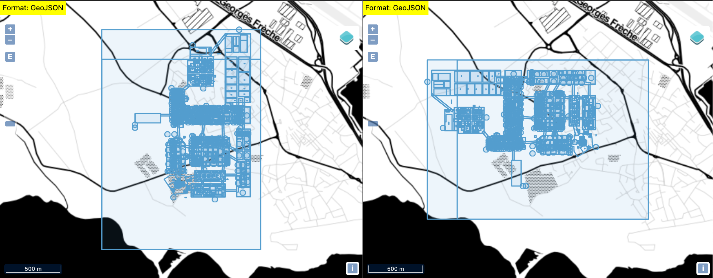

# autocad-to-gis
Tool to convert autocad file format to geojson file format

## Build and run

### with docker

```
$ docker build . -t openindoor/autocad-to-gis
$ docker run --rm openindoor/autocad-to-gis
```

### with docker-compose

``` 
docker-compose up autocad-to-gis
```

## Frontend


## Backend usage

### Specs
```
https://autocad-to-geojson.openindoor.io/api/autocad-to-gis/convert/_LNG_/_LAT_/_XOFFSET_/_YOFFSET_/_ROTATION_/_SCALE_
```

### Example

```
curl -F "file=@data/my_dxf.dxf" \
    https://autocad-to-geojson.openindoor.io/api/autocad-to-gis/convert/3.93/43.56 \
    > my_geojson.geojson
```

Result:


### Play with OFFSET

```
curl -F "file=@data/my_dxf.dxf" \
    https://autocad-to-geojson.openindoor.io/api/autocad-to-gis/convert/3.93/43.56/0.01/0.0 \
    > my_geojson.geojson
```


### Play with rotation

```
$ curl -F "file=@data/my_dxf.dxf" \
    https://autocad-to-geojson.openindoor.io/api/autocad-to-gis/convert/3.93/43.56/0.0/0.0/90.0 \
    > my_geojson_90.geojson
```



### Play with scaling

```
$ curl -F "file=@data/my_dxf.dxf" \
    https://autocad-to-geojson.openindoor.io/api/autocad-to-gis/convert/3.93/43.56/0.0/0.0/0.0/0.5 \
    > my_geojson_0_5.geojson
```


### Setup

```
$ curl \
    -F "file=@data/my_dxf.dxf" \
    -F "setup=@data/setup.json" \
    https://autocad-to-geojson.openindoor.io/api/autocad-to-gis/convert/3.93/43.56/0.0/0.0/0.0/0.5 \
    > my_geojson_0_5.geojson
```

## Maintainer

